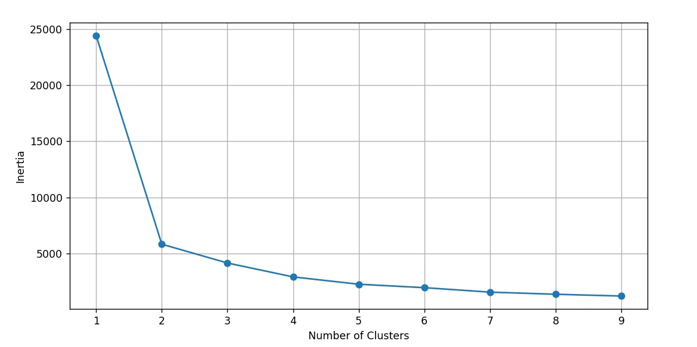
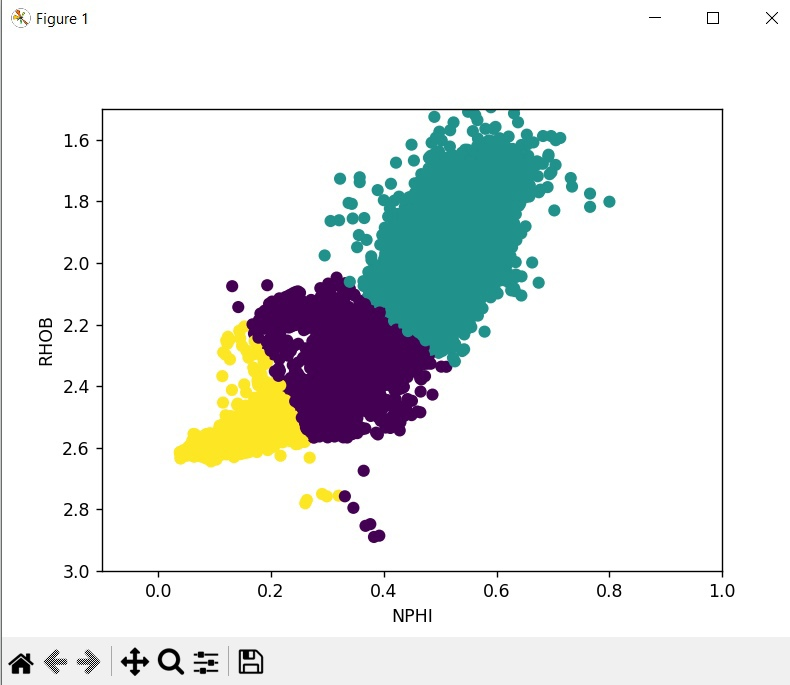

# machinelearning3

Визуализация метода k-средних с использованием базы данных о покупателях  интернет-магазина.
**Вычисление оптимального количества кластеров:**

 

**Разбиение данных на кластеры:**

 

